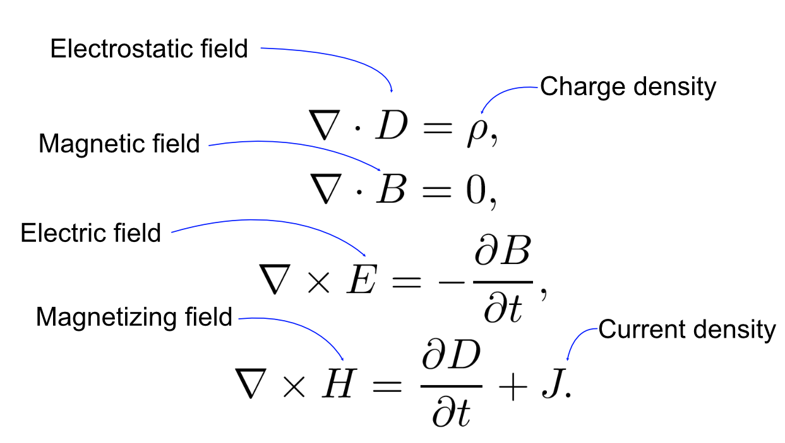

### Maxwell's equations

Maxwell's equations are set of coupled partial differential equations, that combines  all of the phenomena discovered by Oersted, Ampère, Henry, Faraday and others into set of 4 equations which then became the foundation of  classical electromagnetism, optics, magnetism and electricity.  The equations acts as mathematical model for electrical, radio, electric motors, sensors, radar and lenses etc.

### Maxwell's First Equation

Maxwell's first equation is derived from Gauss's theorem which states, the surface integral of the electrostatic field D over a closed surface is equal to the charge enclosed by that surface.

$$\int_{\text {surface }} \mathbf{D} \cdot d \boldsymbol{\sigma}=\int_{\text {volume }} \rho d v$$

Here *ρ* is the charge per unit volume, $$ \boldsymbol{\sigma}$$ is the area vector.

Since, surface integral of a vector field over a closed surface is equal to the volume integral of it's divergence, and therefore

$$\int_{\text {volume }} \operatorname{div} \mathbf{D} d v=\int_{\text {volume }} \rho d v$$

which gives
$$
\nabla \cdot D=\rho
$$

### Maxwell's Second Equation

Magnetic lines of force are closed curves and the magnetic fields have no source or sinks. Consequently the surface integral of the magnetic field over a closed surface is zero and therefore

$$\int_{\text {surface }} \mathbf{B} \cdot d \boldsymbol{\sigma}= \int_{\text {volume }} \operatorname{div} \mathbf{B} d v = 0$$

which gives
$$
\nabla \cdot B=0
$$
*Electric field has source and sink*

### Maxwell's Third Equation

Based on the Faraday's and Len'z laws of electromagnetic induction, which state that the $$e.m.f.$$ induced in a closed circuit is equal to minus the rate of change of B-flux through the circuit i.e. surface integral of $\mathbf {\dot B}$

$e.m.f. = - \int_{\text {surface }} \operatorname{curl} \mathbf {\dot B} . d \boldsymbol{ \sigma}$

Since $$e.m.f.$$ around a closed circuit is the line integral of electric field  $$E$$ around the circuit , which is equal to the surface integral of it's curl, as defined below

$e.m.f = \int_{\text {line }} \mathbf{E} \cdot d \boldsymbol{s}= \int_{\text {surface }} \operatorname{curl} \mathbf{E}. d \boldsymbol{ \sigma}$

Therefore,

$\int_{\text {surface }} \operatorname{curl} \mathbf{E}. d \boldsymbol{ \sigma}  = - \int_{\text {surface }} \operatorname{curl} \mathbf {\dot B} . d \boldsymbol{ \sigma}$

which gives,
$$
\nabla \times E=-\frac{\partial B}{\partial t}
$$

### Maxwell's Fourth Equation

This law is derived from Ampere theorem, which state that the line integral of the magnetic field **H** around a closed circuit is equal to the enclosed current.

$$\int_{\text {loop }} \mathbf{H} \cdot \mathbf{d s}=\int_{\text {area }}(\dot{\mathbf{D}}+\mathbf{J}) \cdot \mathbf{d} \sigma$$

Since, he line integral of a vector field around a closed plane curve is equal to the surface integral of its curl, therefore

$$\int_{\text {area }} \operatorname{curl} \mathbf{H} \cdot d \sigma=\int_{\text {area }}(\dot{\mathbf{D}}+\mathbf{J}) \cdot \mathbf{d} \sigma$$

which gives

$$\operatorname{curl} \mathbf{H}=\dot{\mathbf{D}}+\mathbf{J}$$

or 
$$
\nabla \times H=\frac{\partial D}{\partial t}+J
$$
*Reference - [Physics LibreTexts](https://phys.libretexts.org/Bookshelves/Electricity_and_Magnetism/Book%3A_Electricity_and_Magnetism_(Tatum)/15%3A_Maxwell's_Equations)*

​	
