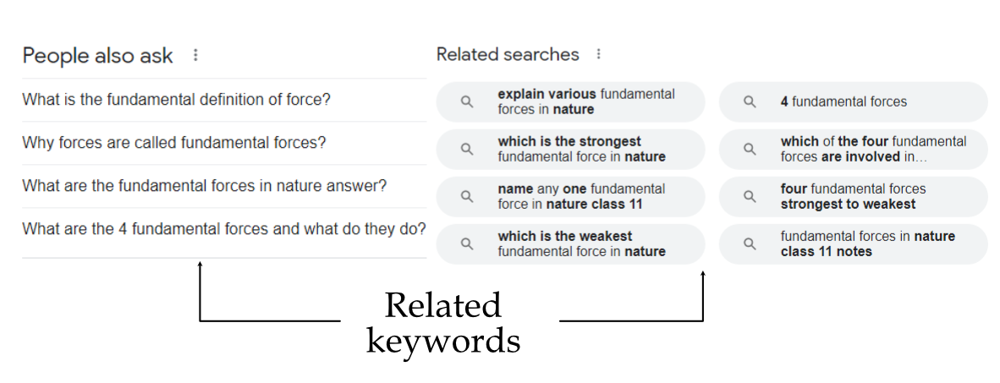
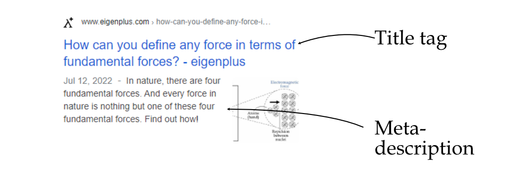
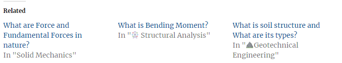

Whenever you create content for any website, you wish that your content comes first whenever a user searches for that in a search engine like **[google.com](http://google.com).** To do that, one uses a certain optimization process called Search Engine Optimization (SEO).

SEO is the process of improving the visibility of the site when users do searches for a particular product or content on the internet through search engines. Better visibility leads to a higher number of visitors to your website.

The SEO becomes critical because almost $$90\%$$ content on the internet don't get any traffic from google-searches.

In this blog post, you will see How to write content for SEO?

## Writing content for SEO

Whenever a user is searching for any particular topic in the search engine. They are trying to get the result of what they are searching for, and their curiosity is satisfied in a minimum time. So, as a result the reader may scan through the entire post first.

To make user your content user-friendly, you first need to make sure that your content is structured correctly and divided into proper sections separated by headings and sub-headings.

The following key points need to be considered whenever writing content for SEO :

### Heading

It should contain the **main keyword** + **related keywords** (optional) + **modifiers** (What, How, List, or, is, etc.)

`main-keyword + related keyword + modifiers `

The main heading becomes the topic of the content and should contain the **main keyword** as a must. You can also add another **related keyword** on the heading apart from the main keyword.

### Sub-heading & Content block

To increase the chances of your post being first, you need to make sure that your sub-headings also contain the **related keywords** or their synonyms.

`related kewords`

In order to get more ideas about the sub-headings, you can check the suggestions offered at the end of search results or the “ **People also ask:**” section in search page results.

Presence of **related keywords** in the sub-heading improves indexing of the page. 

### Meta-data

It shows additional information about the page in the search results. It is not directly shown on your website page. Here is an example of what meta-data looks like when searching in a search engine.

It comprises of two things -

- **Title tag** *[This affects ranking]* - It can be the heading or a combination of heading and website name.

`Main keyword + Additional keyword + modifiers`

- **Meta description** *[This doesn’t affect ranking but affects Click-through rate (CTR)]*- It is a snippet that provides short and relevant summary about a particular page.

### Image optimization

Image optimization has a two-fold effect. It improves the page ranking in search results and also increases the traffic coming from image search results.

- **Image name** - The image should be named properly before uploading to the website. Instead of putting a random name, use **a name that describes the image** or/and **keywords**.

- **Alt tag (Alternative tag)**- Another way of desc*ribing* what the image is about. It is not visible on the website page directly, but it is present in the HTML file of the page. So, whenever a google goes through the page, it reads the written **alt tag.**

  The alt tag is also visible on a website page when images are disabled.

  So, the alt tag should either be a word or phrase **describing the image** or the **page** it belongs to.

- **Image size** - Image size should be less in order to increase page loading speed.

### Internal-links

Internal links are the link to different pages within the same website.

It helps improve the discoverability of your pages and, more importantly, keeps visitors engaged in your website.

- **Anchor text** : Anchor text is the word or phrase used to link to another page. Example- [‘Anchor text’](https://yoast.com/what-is-anchor-text/#:~:text=Anchor%20text%20%E2%80%94%20or%20link%20text,they%20click%20on%20the%20link.) or the text should be descriptive.

You can add an internal link by adding **an in-text link** or by adding separate **link blocks** that contain a set of links related to that page content.

Example of **in-text link:** [‘Anchor text’](https://yoast.com/what-is-anchor-text/#:~:text=Anchor%20text%20%E2%80%94%20or%20link%20text,they%20click%20on%20the%20link.)

Example of link-blocks: “Related post” at the end of the page.

**References  -** 

* [Course - Marketing Strategy: SEO Content Writing](https://www.linkedin.com/learning/marketing-strategy-seo-content-writing)
* [What is SEO ?](https://searchengineland.com/guide/what-is-seo)
